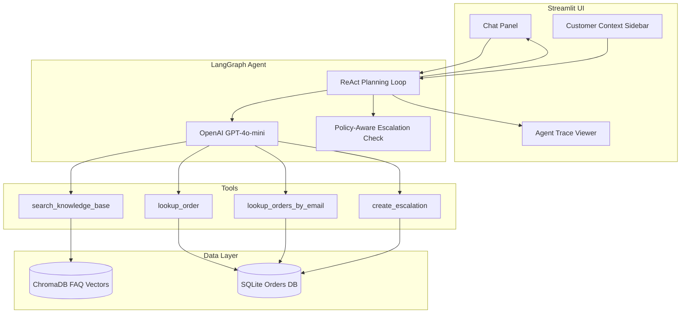

# ShopMate System Architecture

## Overview

ShopMate is a ReAct-style agentic customer support system. A Streamlit frontend sends user messages to a LangGraph orchestration layer, which invokes an LLM to reason and select tools. Tools query a SQLite order database, a ChromaDB knowledge base, or create human escalation tickets.

## Architecture diagram

## Component responsibilities

| Component | Role |
|-----------|------|
| `app/main.py` | Streamlit entry point, session state, tabs |
| `agent/graph.py` | LangGraph ReAct loop, agent invocation |
| `agent/tools.py` | Tool definitions and escalation policy rules |
| `agent/memory.py` | Session context, chat history, trace logging |
| `agent/kb_store.py` | ChromaDB embedding and semantic search |
| `agent/database.py` | SQLite init, order queries, escalation storage |
| `eval/run_eval.py` | Batch evaluation across agent baselines |

## ReAct execution flow

1. User sends message via Streamlit chat.
2. Policy check scans for escalation triggers (damaged item, double charge, human request).
3. LangGraph agent node calls LLM with system prompt, session context, and chat history.
4. LLM returns tool call(s) or final answer.
5. Tool node executes selected tools and returns observations.
6. Loop repeats until LLM produces a final response or max iterations reached.
7. Trace steps are logged and displayed in the Agent Trace tab.

## Baseline modes

| Mode | Tools | Purpose |
|------|-------|---------|
| `full` | KB + orders + escalation | Production agent |
| `kb_only` | KB search only | Ablation: policy without order data |
| `none` | No tools | Ablation: raw LLM (hallucination baseline) |
